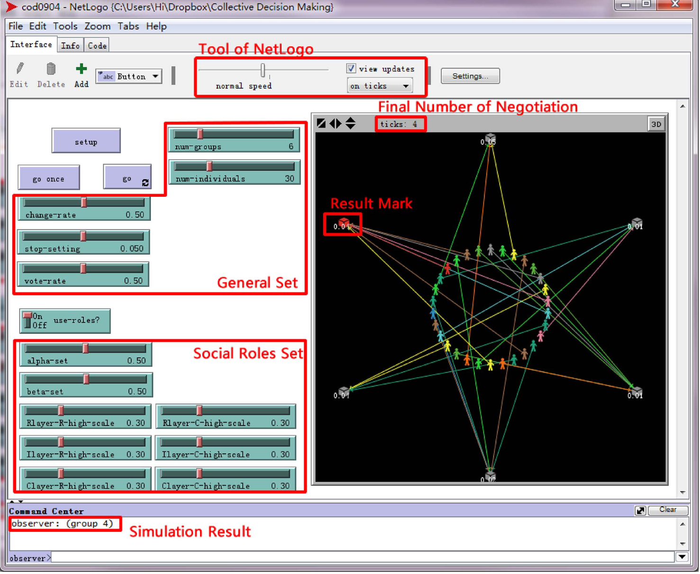

## 1 A Collective Decision Model Involving Vague Concepts and Linguistic Expressions

- 在该决策模型中，语言评估由语言表达式表示，这些语言表达式是通过将逻辑连接词应用于基本语言标签集而获得的逻辑公式。
-  这种集体决策模型的基本思想是将由语言表达确定的语义相似性分布转换为相应语言表达的概率分布。
- 该模型的主要优点是能够处理复杂的语言评估和相邻语言标签之间的部分语义重叠。
- 使用语义相似性关系来捕获概念的模糊性是很自然的。 
- 在语言集体决策中，提供了一组语言表达来评估基础对象；每个对象对应一个信息源。 所谓语言表达是通过将逻辑连接词应用于语言标签而生成的语言逻辑公式。 集体决策的主要目标是使用组合的语言信息选择最佳选择。**在我们提出的集体决策模型中，我们允许任何相邻的基本语言标签都具有部分语义重叠。 为了融合信息源提供的所有语言表达，首先，我们将每个语言表达转换为等效表达-通过使用基本语言标签之间的语义相似关系在基本语言标签集上定义的概率分布。然后，使用加权求和将所有 从每种语言评估的所有 语言评估中得出的概率分布 。 最后，我们在提出的模型中引入了两种可能的决策方法来进行集体决策。** 
-  在我们提出的集体决策模型中，我们使用**显式模糊关系**来捕获语言标签之间的语义相似性。然而，这种模糊关系中的推理机制**并非基于模糊逻辑，而是推理方法**。 我们提出的模型的主要优点在于，它可以**处理具有部分语义重叠的语言标签，并处理复杂的语言表达式-由语言标签和某些逻辑连接词生成的逻辑公式**。 传统的语言信息融合模型无法处理语言表达。

## 2 Analyzing Social Roles Based on a Hierarchical Model and Data Mining for Collective Decision-Making Support

- 通常，在**SNS** 系统中，活跃用户可能不会代表整个用户中的主要观点，并且大多数用户的观点可能是多种多样的。 **在本文中，我们专注于分析和识别用户的动态社交角色，以促进集体决策过程。**  在介绍了社会选择理论和改进的集体决策模型之后，我们提出了一个三层模型，以分层方式分析用户的社会角色，并开发了一种集成机制来利用社会角色的识别来支持集体决策。

- **我们专注于基于对用户不同社会角色的分析和识别来协助集体决策过程。** 

- 因此，分析用户在现实世界和网络世界中的社会角色以更好地了解用户的需求非常重要， 这将有助于在集体决策过程中有效地达成决策共识。

- 社会选择理论和集体决策模型之后，我们提出了一个社会角色分析模型，其中引入了三层，即内容层，个人档案层和关系层，以分析企业中的社会角色。 等级制方式。 然后，根据社会角色的动态识别，开发了一种机制来支持集体决策过程。 

- 我们引入了COD系统并开发了一个基于NetLogo的工具，分别使用我们提出的基于社会角色的方法和Delphimethod来演示谈判过程。 评估实验表明，与传统方法相比，该方法是有效的。 最后，提出了一个应用场景，以展示增强型系统如何通过分析用户的社会角色来支持集体决策过程。

  

## 3 An Agent-Based Model of Collective Decision-Making: How Information Sharing Strategies Scale With Information Overload

- 但是，随着**组织** 面临越来越多的信息超载，目前尚不清楚此类策略是否仍然足够或人类理性的界限是否会占上风。我们开发了一种**基于代理的模型** 来模拟团队中的信息共享，在团队中关键信息分布在各个成员之间。 我们根据集体决策的速度和准确性测试了各种信息共享策略对信息过载和合理性边界的鲁棒性。我们的结果根据速度或准确性的必要性提出了不同的策略，并且从更广泛的意义上揭示了智能如何最佳 在集体决策中取得成就。
- 组织非常适合于整合来自多个人的各种信息以产生明智的集体决策。 组织可以**将具有不同领域专业知识的人员召集在一起** ，并在制定决策时使用**机制（例如团队，例程和层次结构）**来整合他们的各种信息。
- 信息技术专长的深层多样性为面临复杂问题的团队提供了优势。
- 

