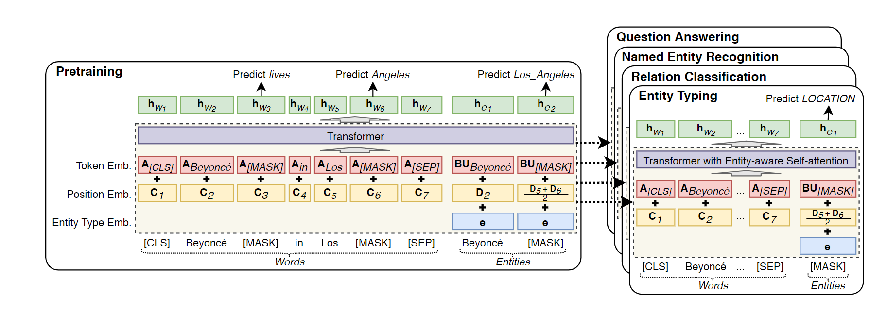

## End-to-end Sequence Labeling via Bi-directional LSTM-CNNs-CRF
> - 中文笔记 https://blog.csdn.net/YoungDreamNJU/article/details/54346658

## LUKE: Deep Contextualized Entity Representations with Entity-aware Self-attention

- transformer?

- BERT?

- 

  > - BERT的替换（预训练语言模型相关有些论文）
  > - 模型中entities的扩充（基于字典）

- entity-aware self-attention mechanism?

-  LUKE is trained to predict randomly masked words and entities using a large amount of entity-annotated corpus obtained from Wikipedia.

- training task: MLM

- Span-BERT: mask word spans instead of single words

-  Know-BERT: enhance CWRs using static entity embeddings separately learned from KB

- 